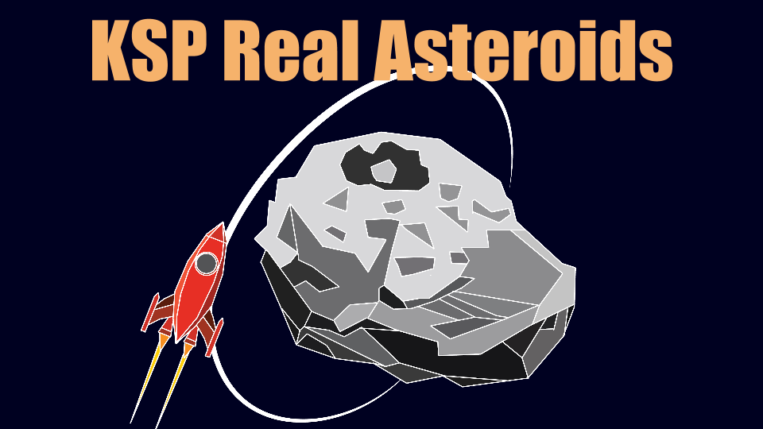

# KSP-Real-Asteroids

Created during the 2015 SpaceAppsChallenge in Boston: https://2015.spaceappschallenge.org/project/explore-capture-and-redirect-real-asteroids-in-kerbal-space-program/

Our presentation for the event is available here: https://docs.google.com/presentation/d/1OTNT7ZLz8V07lehsxV4-J6aZdaToWilgjvU1asy5vpM/edit?usp=sharing

## What is this?

This game mod will add REAL asteroid data into the game Kerbal Space Program and create missions so we can explore them, capture them and perhaps even sling them out into a different orbit.

## Why do this?

Learning about asteroids, how big they are, what they look like and what can be done with them in an interactive way where you control the outcome is an excellent way of teaching kids, teens and adults about all the asteroids that are out there. With this project we hope to show how asteroids are spread out throughout our solar system, how to get to them and also how to maybe save Earth one day if needed.

## How?

By using the graphics and game engine in the fun and creative game Kerbal Space Program we will build a mod that will load REAL asteroids into the game, with the correct orbits and sizes, and then have missions to explore them, capture them and sometimes sling them out into a different orbit.

## Installation

1. Install the following mods:
 - CustomAsteroids (https://github.com/Starstrider42/Custom-Asteroids/releases/tag/v1.1.0)
 - Kopernicus (https://github.com/BryceSchroeder/Kopernicus/releases)
 - ContractConfigurator (http://forum.kerbalspaceprogram.com/threads/101604)
2. Copy the contents of the folders in this repo to your GameData folder
3. ???
4. Profit!

### Want more asteroids?
There's a script called asteroids.py, that reads data from asteroids.csv (created from the JPL database) and automatically generates thousands of asteroids with as accurate data as possible. Use it, and copy the asteroids you want into your Kopernicus library.

## Todo:
- Figure out if it's possible to stop the spawning of a specific asteroid after it's been spawned once, using CustomAsteroids. We've created Bennu in CustomAsteroids and would like it to only appear once
- Create more asteroids like Dionysus and 90 Antiope
- Since Bennu also is a binary system (with a much smaller moon), we might create that using Kopernicus as well
- Fix the asteroid orbit, mass and rotation data to correspond correctly with the real ones. Right now the settings are close but not entirely correct
- See if we can create a version for Real Solar System as well
- Fix the missions to work flawlessly
- Create random textures to be used for the asteroids.

### Contributors
 - Jonas Rosland [@jonasrosland](https://twitter.com/jonasrosland)
 - Lisa Johnson [@lkjohnsn](https://twitter.com/lkjohnsn)
 - Caroline Troein [@carolinetroe](https://twitter.com/carolinetroe)
